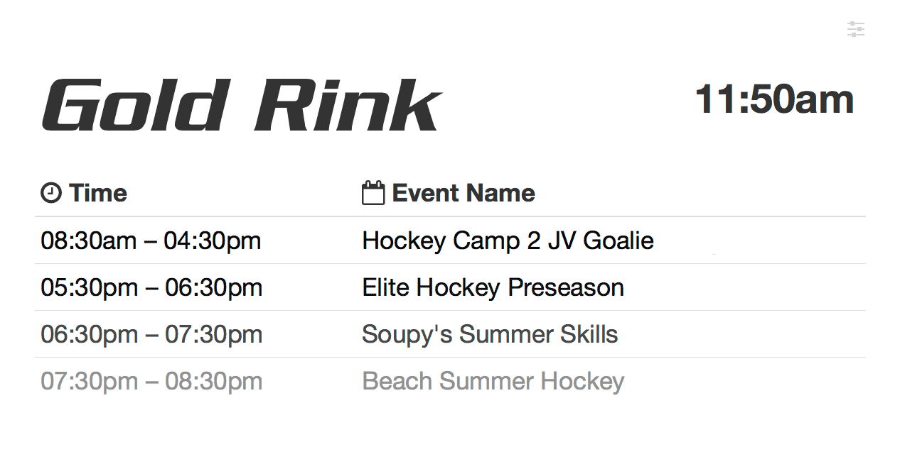
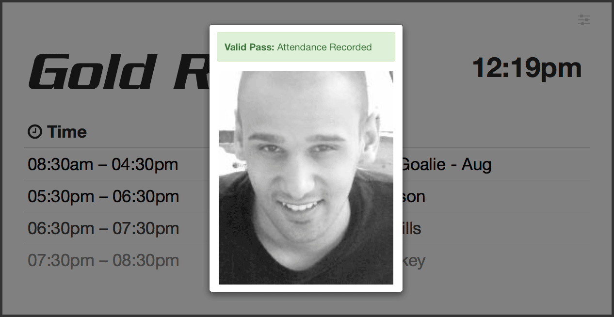
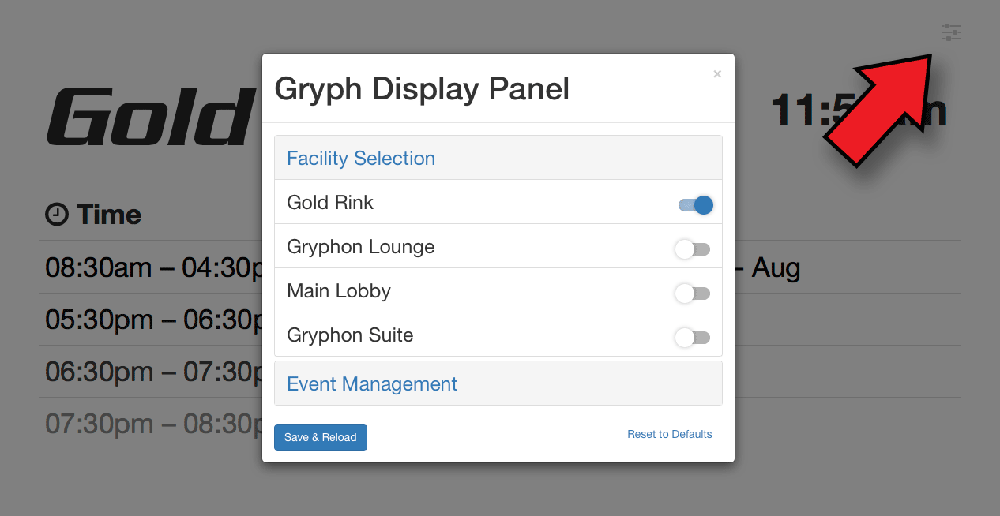
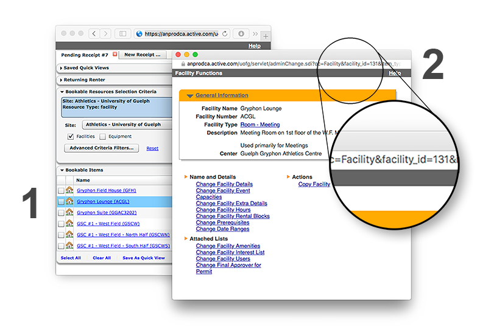

# gryph-display-panel (GDP)

GDP is a web application developed for the University of Guelph's athletic department's new digital signage. It is designed to display meeting and event scheduling, as well as to validate and report member participation during classes. It does this through Active Net's SOAP WSDL service and by making server side https requests using curl.

It's backend is developed using PHP and the frontend using JavaScript, Bootstrap, and HTML. The service can be run as a simple web page in a browser on a PC or mobile device.


## Features

### Viewing Events



GDP has a responsive design that can scale to a variety of device and screen ratios. It will limit the number of displayed events by the amount displayable by the screen. It can be configured, as described below, to highlight the current event and to cull passed events.


### Pass Validation

Pass validation works by capturing keypresses from the browser and submitting once the enter key is pressed. A card reader or RFID scanner which registers as a keyboard device is the intended source of input. Regular expressions are used to parse members IDs so that these devices can be used out of the box without configuring their output formatting. Student, staff, or Active IDs should all work in order to pull up membership accounts.

When a swipe is registered it is validated against the workstation ID associated with it (see administration below). This works the same way as it would through the front desk. Swipes are recorded and can be used to generate usage reports.

When a swipe is registered, one of three modals will be displayed:

- **Valid Pass**, in green, which indicates that the member has a valid membership which qualifies for the activity.
- **Invalid Pass**, in yellow, which indicates that the member has a valid membership, but one that does not qualify for the activity.
- **Invalid Membership**, in red, which indicates that the member does not have a valid membership.

If the user does not have a valid pass they are advised to see the front desk for assistance.




### Configuration

All of the service's settings can be configured through the browser with a mouse or touchscreen. Just click on the settings icon in the top right of the screen. This will pop up a configuration modal where the user can change the displayed facility and set event management options, such as highlighting the current event and toggling whether past events are displayed. Click 'Save & Reload' to commit changes.




## Deployment

### Server Setup

Before being hosted `data/auth.txt` needs to be configured with Active Net credentials. The first line must contain the plaintext username for the account and the second line must contain the corresponding password. This file is accompanied by a `.htaccess` file to protect it from being server with Apache.

The latest version distributable version of GDP can be downloaded from the releases page or build interactively using [grunt](http://gruntjs.com). Either way the web application can be deployed by uploading the contents of 'dist' to a web server. Ensure that the 'cache' directory has full read-write access for the `apache` user or else swiping will not work-- ie. `chmod -R 777 cache`. GDP requires PHP and has been tested as working with versions 5.3, 5.6, and 7.0.

If you chose to go the grunt route you need to have [NodeJS](https://nodejs.org) installed on your system. Afterwards GDP can be transpiled and configured interactively using the following commands:

```
npm install
bower install
grunt
```


## Administration

### Managing Facilities

Facilities can be managed by editing the `GDP_FACILITIES` object within the `js/gdp-config.js` file. Here's a breakdown of the various fields and how they are formatted:  

```
var GDP_FACILITIES = {
    [active#]: {
        name: "[...]",
        workstation: #,
        visible: [true/false]
    }
};
```

- **active#:** the unique active net facility id used as the key to query event information
- **name:** the name which gets used as the header for the facility page
- **workstation:** the workstation id used to record swipes within Active Net; set to zero to disable swiping
- **visible**: if set to true will appear in the facility selection dropdown menu, otherwise omitted


#### For example...

```js
var GDP_FACILITIES = {
    27: {
        name: "Gold Rink",
        workstation: 34,
        visible: true
    },
    131: {
        name: "Gryphon Lounge",
        workstation: 0,
        visible: true
    },
    541: {
        name: "Main Lobby",
        workstation: 34,
        visible: false
    },
};
```

This scheme would make two facilities selectable from the dropdown menu, Gold Rink and Gryphon Lounge. By using a workstation number of 34, it would record card swipes at the W.F. Mitchell building's left turnstile. Main Lobby would not show up in the facility menu because it's visible entry is set to false.


#### Finding Active Net Facility IDs

Facility IDs are used internally by Active Net in order to query event listings. Unfortunately the process of finding them is somewhat involved.

Log in to Active Net and navigate to the [Resource Scheduler](https://anprodca.active.com/uofg/servlet/flexResourceScheduler.sdi). Click on the blue link for the facility you are interested in (1). This will activate a popup window. The URL for this window will have the text `facility_id=...` that number is the facility id. For instance, in the depicted example it would be 131(2).




#### Finding Active Net Workstation IDs

Workstation IDs are used internally by Active Net in order to process pass validation. As with facility IDs, they are also somewhat involved to find.

Log in to Active Net and navigate to [workstation selection](https://anprodca.active.com/uofg/servlet/processAssiegnWorkstation.sdi). Select the workstation that you are interested in from the 'Existing Workstation Name' dropdown and click submit. The workstation ID is saved as a cookie named `uofg_workstation_id`. You can find these using your browser's inspection tools or by using an extension like Chrome's [cookies.txt](https://chrome.google.com/webstore/detail/njabckikapfpffapmjgojcnbfjonfjfg).


#### Setting Default Settings

You are able to configure the default and fallback options for GDP in  `js/gdp-config.js` as well by changing the values in `GDP_SETTINGS`. These are loaded by default when the system is powered or when cookies are cleared.

- **show_passed_events:** events will be removed as they finish if false, else the page will remain static until manually refreshed if true (dafault false)  
- **limit_events:** will limit the maximum number of events to 5 at one time, preventing overflowing (default true)
- **facility:** the Active Net facility id to use on start (default 131, Gryphon Lounge)


### Kiosk Setup

The kiosks will be deployed on about a dozen Raspberry Pi 3s paired with 22" Dell touchscreen LCD displays. The Pis are running a customized version of Raspbian Jessie Lite. It runs a full-screen Midori browser using Matchbox window manager. This package mounts the SD card as read-only in order to improve security and prolong the life of SD cards.

The filesystem can be easily be remounted with either read-only or read-write access for maintenance, etc. by executing `/root/remount.sh ro` or `/root/remount.sh rw`, respectively. tty2 onwards have been disabled to prevent tampering and the sudo account cannot be SSHed into directly. Only the `gdp` user can be SSHed into using public-private key pairs.


#### Formatting the SD Card (POSIX)

- [Download the latest image](https://gryphons.ca/gryphrec/gdp/rpi)  from gryphons.ca.
- Expand the gzip archive; ie. `tar xvzf gdp-v1.img.tar.gz`.
- dd the image onto the SD card; ie. `dd bs=512 if=~/Downloads/gdp.img of=/dev/rdisk2`.


#### Formatting the SD Card (Windows)

- [Download the latest image](https://gryphons.ca/gryphrec/gdp/rpi)  from gryphons.ca.
- [Download 7zip](http://www.7-zip.org/download.html) to expand the gzip archive.
- [Download Win32 Disk Imager](https://sourceforge.net/projects/win32diskimager) to copy the image onto the SD card.
